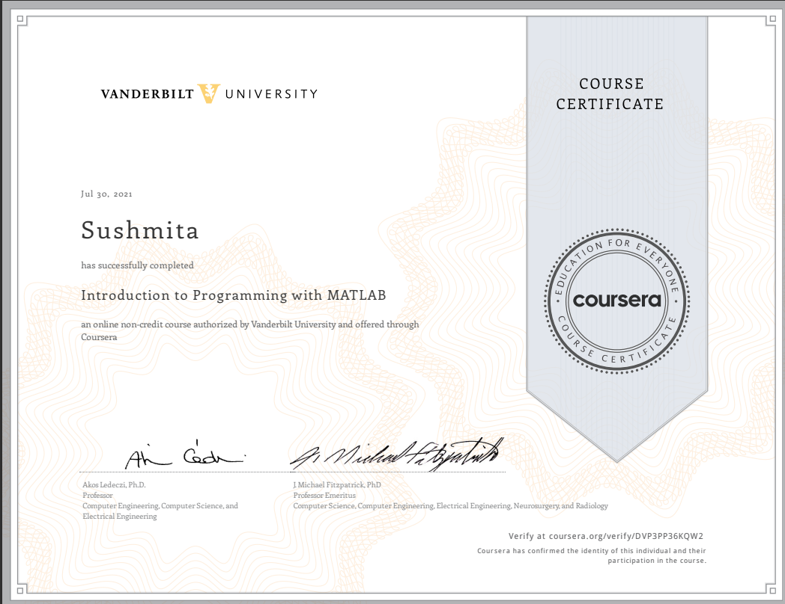

# Introduction to Programming with MATLAB ~ Vanderbilt University

## 📖 Overview
- WEEK2: The MATLAB Environment
- WEEK3: Matrices and Operators
- WEEK4: Functions
- WEEK5: Programmer's Toolbox
- WEEK6: Conditional statements and logical operators
- WEEK7: Looping statements
- WEEK8: Data Types
- WEEK9: File Input/Output

## 🙂Certificate

